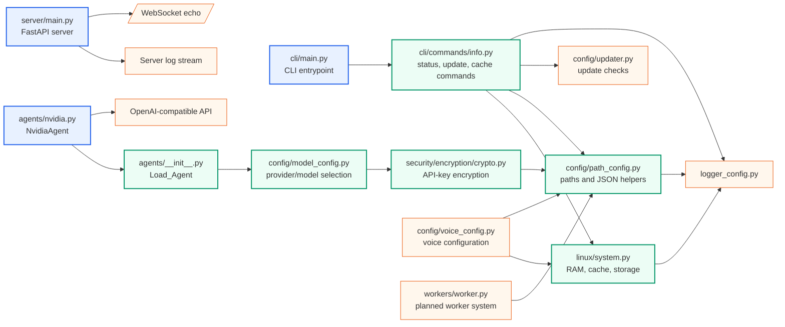
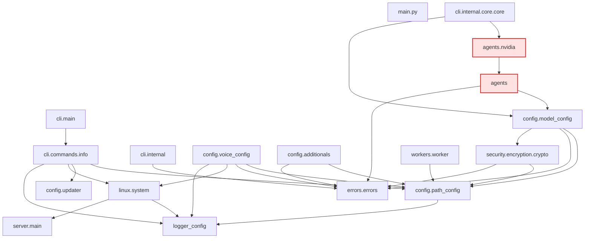
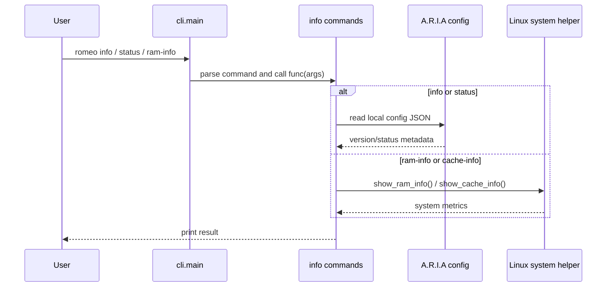

# A.R.I.A code graphs

These diagrams describe the current Python codebase. External libraries are shown only where they are important to the runtime flow.

## Runtime architecture

## Internal Python import graph

## Main execution paths

## Notes

- `agents` and `agents.nvidia` form an import cycle: `agents.nvidia` imports `Load_Agent` from `agents`, while `agents` owns `Load_Agent`.
- `linux.system` imports the logger object from `server.main`, which makes importing Linux initialize FastAPI server logging as a side effect.
- `main.py` is currently empty; the practical entrypoints are `cli.main`, `server.main`, and `agents.nvidia`.
